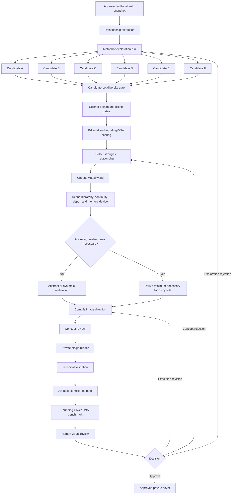
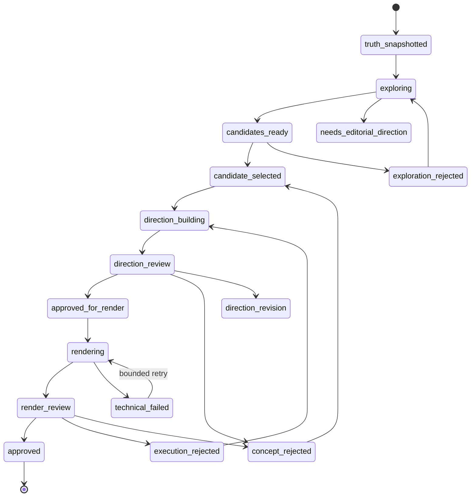
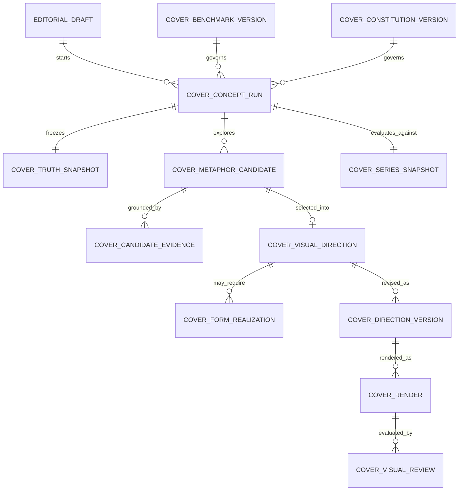

# The Vitalspan Brief Cover System — Phase 4 Architecture

Status: architectural design only

Version: 1.0

Owner: Vitalspan

Depends on: Phase 3C production cover workflow
Canonical visual sources: `.claude/VITALSPAN_ART_BIBLE.md` and `.claude/FOUNDING_COVER_DNA.md`

No implementation, migration, deployment, image generation, publication, schedule, or Art Bible change is authorized by this document.

---

## 1. Executive decision

Phase 4 replaces the object-first cover workflow with a persisted concept-first architecture.

The old effective sequence is:

```text
editorial thesis
→ confidence-to-composition mapping
→ physical world
→ hero object and supporting objects
→ prompt serialization
→ image model
```

The Phase 4 sequence is:

```text
editorial truth
→ editorial relationship
→ multiple metaphor candidates
→ grounded selection
→ visual world
→ form realization, only when needed
→ image direction
→ render
→ founding-cover benchmark review
```

The architectural unit of authorship becomes the **editorial relationship**, not the hero object.

Objects are no longer mandatory concept fields. They may appear late as one possible material realization of a selected metaphor, but they cannot define the metaphor or determine the composition in advance.

The founding cover becomes the permanent quality benchmark through a versioned reference record, concept-stage alignment checks, and the full post-render `FOUNDING_COVER_DNA.md` scorecard. The benchmark measures editorial integration, hierarchy, continuity, metaphor, depth, materiality, thumbnail identity, emotional impact, and memorability. It does not require imitation of the founding artwork's anatomy, palette, density, or arrangement.

---

## 2. Scope

Phase 4 designs:

- A concept-first decision chain
- A metaphor-candidate engine
- Candidate diversity and scientific-claim gates
- Deterministic scoring and selection
- Visual-world selection after metaphor selection
- Optional late-stage form derivation
- Founding-cover quality calibration
- A normalized metadata model
- Review and regeneration semantics
- A safe additive migration and cutover plan
- Admin workflow, observability, and acceptance criteria

Phase 4 does not:

- Revise the Art Bible
- Change editorial article ranking or source selection
- Change the approved editorial thesis
- Select a new image provider
- Implement model calls or database functions
- Generate an image
- Approve or publish a cover
- Enable cron
- Expose private concepts, prompts, or rejected assets

---

## 3. Architectural principles

### 3.1 Editorial truth is immutable input

The approved thesis, confidence, theme type, source evidence, cover-paper role, principal uncertainty, and prohibited implications are snapshotted at the beginning of a concept run. Visual exploration may interpret them but may not rewrite them.

### 3.2 Relationships precede visual nouns

The first creative stage may describe tensions, transformations, correspondences, asymmetries, thresholds, accumulations, exchanges, absences, or changes of scale. It may not nominate a hero object or assemble a prop list.

### 3.3 Multiplicity precedes commitment

The system must generate several meaningfully distinct metaphor candidates before selecting one. A single candidate is a failed exploration, even if it is technically valid.

### 3.4 Selection is editorial, not merely aesthetic

The winning candidate must be the strongest expression of the approved thesis under scientific restraint. Ease of rendering, familiarity of objects, and surface attractiveness are not selection criteria.

### 3.5 The visual world follows the metaphor

Composition, density, spatial organization, depth, material behavior, and visual mode are selected only after the editorial relationship is chosen.

### 3.6 Forms serve roles

If recognizable forms are needed, each must have an explicit editorial or compositional role. There is no required hero object, object count, vessel, tabletop, or still-life surface.

### 3.7 The founding benchmark measures intelligence, not resemblance

Future covers inherit the founding cover's integration, continuity, hierarchy, material specificity, curiosity, and memorability. They must not copy its literal motifs or exact composition.

### 3.8 Generation and review remain private and separate from publication

Concept approval, render approval, editorial draft approval, and publication remain distinct state transitions.

### 3.9 No fallback to a generic still life

When no candidate passes the concept gates, the run stops in `needs_editorial_direction`. It never silently substitutes a bowl, vessel, seed, stone, folded paper, or other familiar visual shorthand.

---

## 4. End-to-end pipeline



### Decision ownership

| Decision | Primary owner | Deterministic guard |
|---|---|---|
| Editorial truth | Editorial pipeline and editor | Source grounding and approved draft snapshot |
| Candidate generation | Metaphor engine | Structured candidate contract |
| Candidate diversity | Deterministic evaluator | Minimum count and conceptual-distance rules |
| Candidate selection | Scoring engine, editor-visible | Hard gates, weighted score, auditable rationale |
| Visual world | Visual-direction engine | Art Bible compatibility and series context |
| Form realization | Visual-direction engine | Necessity and role checks |
| Render | Provider adapter | One private output per authorized attempt |
| Final visual quality | Founding DNA evaluator and editor | Canonical 20-point benchmark plus hard failures |
| Publication | Existing protected workflow | Approved draft and approved cover required |

---

## 5. Stage 0 — Editorial truth packet

Every concept run begins with an immutable `editorial_truth_snapshot`.

Required contents:

- Draft ID and issue number
- Approved editorial thesis
- Theme confidence and type
- Theme keywords
- Grounding phrases for every selected source
- Deterministic cover-paper role
- Principal uncertainty
- Claims the image must not imply
- Population, intervention, outcome, and study-design distinctions
- Current Art Bible version and content hash
- Current Founding Cover DNA version and content hash
- Prior-eight-cover series context snapshot

The packet contains no visual objects, composition family, palette, or stylistic proposal.

If the editorial thesis changes, a new concept run is required. Existing candidates remain immutable historical records and cannot be relabeled against the new thesis.

---

## 6. Stage 1 — Relationship extraction

Relationship extraction converts editorial truth into a small set of non-visual propositions.

Required outputs:

- **Core proposition:** the shortest defensible statement of what the issue argues
- **Central tension:** the unresolved editorial opposition or dependency
- **Governing verb:** what changes, resists, accumulates, exchanges, diverges, adapts, or remains incomplete
- **Evidence boundary:** what prevents full resolution
- **Reader question:** the question the image should leave active
- **Confidence behavior:** how uncertainty must remain visible
- **Forbidden resolution:** the visual conclusion the system must avoid

Example structure, without prescribing a visual solution:

```text
Proposition: A promising signal can become decision-relevant without becoming decision-sufficient.
Tension: visibility versus certainty.
Governing verb: approaches but does not resolve.
Evidence boundary: heterogeneous evidence limits a shared conclusion.
Reader question: when does a signal justify action?
Forbidden resolution: a completed crossing or unified mechanism.
```

Relationship extraction is complete only when the result can be understood without naming an object, organ, material, setting, or image style.

---

## 7. Stage 2 — Metaphor engine

### 7.1 Purpose

The metaphor engine explores different ways to make the same editorial relationship visible. It does not design a cover and does not select objects.

### 7.2 Candidate count

Each run produces exactly six initial candidates.

Six is sufficient to require meaningful exploration while keeping comparison legible. A run may request one replacement candidate for each candidate rejected by a structural gate, up to three replacements. It may never generate repeated unbounded batches.

At least four structurally distinct candidates must survive before selection. Otherwise the run becomes `needs_editorial_direction`.

### 7.3 Relational operators

Candidates are generated through abstract relational operators. These are thinking lenses, not composition families or mandatory visual modes:

- Correspondence across scales
- Unequal exchange
- Partial transformation
- Accumulation or erosion
- Threshold or phase change
- Constraint and counterforce
- Divergence from a shared condition
- Distributed interdependence
- Absence, interruption, or missing continuation
- Temporal lag or asynchronous change
- Protective benefit with visible cost
- Pattern alignment that remains incomplete

No operator has a default object vocabulary.

### 7.4 Candidate contract

Each metaphor candidate contains:

| Field | Meaning |
|---|---|
| `candidate_id` | Immutable identifier |
| `ordinal` | Position in the exploration set, not rank |
| `relationship_statement` | The editorial relationship expressed in one sentence |
| `metaphor_statement` | The proposed visual analogy without a prop inventory |
| `governing_behavior` | The active transformation or tension |
| `unresolved_condition` | What remains incomplete or conditional |
| `category_collision` | The two conceptual categories whose overlap creates curiosity |
| `continuity_logic` | How distinct forms or scales could belong to one visual world |
| `macro_structure_potential` | The large-scale organization suggested by the metaphor |
| `memory_device` | The one relationship intended to remain after viewing |
| `productive_ambiguity` | The second plausible reading that enriches interpretation |
| `scientific_boundary` | The visual conclusion the candidate must not imply |
| `source_grounding` | Source IDs and exact phrases supporting the candidate |
| `object_dependency` | `none`, `optional`, or `essential`, with justification |
| `genericity_test` | Why the candidate could not illustrate an arbitrary health topic |
| `series_distinction` | How it differs conceptually from the prior eight covers |

The candidate contract contains no `hero_object`, `supporting_objects`, `physical_world`, or palette.

### 7.5 Object-dependency rule

`object_dependency = essential` is permitted only when the candidate explains why a recognizable object is necessary for the editorial meaning and why a field, system, material behavior, spatial relation, or transformed environment cannot carry it more directly.

Object dependence never improves a candidate's score. When two otherwise equal candidates exist, the candidate with lower object dependence wins.

---

## 8. Stage 3 — Candidate-set diversity gate

The engine evaluates the six candidates as a set before scoring them individually.

The set passes only when:

- At least four distinct relational operators are represented.
- No two candidates share the same relationship statement with only different nouns.
- No two memory devices reduce to the same silhouette event.
- At least two candidates have `object_dependency = none`.
- No more than two candidates have `object_dependency = essential`.
- At least one candidate supports a continuous field or system.
- At least one candidate supports a quiet, sparse treatment.
- At least one candidate supports controlled visual richness.
- Semantic similarity remains below the configured candidate-pair ceiling.
- The set does not reproduce the selected metaphor structures of the prior eight covers.

Candidate-set diversity is a hard gate, not a scoring bonus. Six cosmetically different still lifes count as one idea and fail.

---

## 9. Stage 4 — Scientific and editorial safety gates

Each candidate is checked before aesthetic scoring.

### 9.1 Hard scientific failures

A candidate is rejected if it:

- Invents a shared biological mechanism
- Converts association into causation
- Visually promises clinical benefit
- Resolves uncertainty that the thesis leaves open
- Erases material differences among populations, interventions, outcomes, or study designs
- Makes the cover paper appear definitive or universally representative
- Implies cure, rejuvenation, immortality, or treatment instruction

### 9.2 Hard editorial failures

A candidate is rejected if it:

- Is understandable only after reading an explanation
- Could illustrate almost any health topic
- Depends on a biomedical or wellness cliché
- Is merely an object substitution for an abstract concept
- Uses complexity as decoration rather than argument
- Uses minimalism as a substitute for conceptual clarity
- Copies the founding cover's nouns, arrangement, or specific biological reading
- Repeats a recent cover's core metaphor or memory device

### 9.3 Risk annotations

Passing candidates retain explicit risk annotations:

- Mechanism risk
- Causation risk
- Clinical-promise risk
- Literalism risk
- Cliché risk
- Genericity risk
- Founding-cover imitation risk
- Series-repetition risk

Risk annotations remain visible to the editor and become constraints in later stages.

---

## 10. Stage 5 — Candidate scoring and selection

### 10.1 Weighted score

Every passing candidate receives a transparent 100-point score.

| Dimension | Weight | Question |
|---|---:|---|
| Thesis fidelity | 15 | Does the candidate express the approved editorial thesis rather than a nearby topic? |
| Relationship clarity | 10 | Is the governing relationship intelligible without object labels or explanatory prose? |
| Editorial specificity | 10 | Could this metaphor belong only to this issue or a narrow class of equivalent theses? |
| Metaphor depth | 15 | Does the analogy support interpretation beyond a one-step rebus? |
| Memorability potential | 15 | Is there one relationship likely to remain after the viewer looks away? |
| Macro-structure potential | 10 | Can it produce a distinctive silhouette or field structure at thumbnail size? |
| Continuity potential | 10 | Can several elements belong to one visual grammar without implying a false mechanism? |
| Productive ambiguity | 5 | Does it support a meaningful second reading without becoming vague? |
| Scientific restraint | 10 | Does it preserve uncertainty and avoid unsupported visual conclusions? |
| **Total** | **100** | |

### 10.2 Selection threshold

A candidate is selectable only when:

- It passes every hard gate.
- Total score is at least 75/100.
- Thesis fidelity is at least 12/15.
- Metaphor depth is at least 11/15.
- Memorability potential is at least 11/15.
- Scientific restraint is at least 8/10.

### 10.3 Deterministic tie-breakers

If candidates are tied, selection proceeds in this order:

1. Higher thesis fidelity
2. Higher memorability potential
3. Higher metaphor depth
4. Lower scientific risk
5. Lower object dependency
6. Greater distinction from the prior eight covers
7. Lower candidate ordinal for reproducibility

### 10.4 Selection record

The system stores:

- All candidate scores
- Hard-gate outcomes
- Set-diversity result
- Winning candidate ID
- Selection rationale
- Tie-break path, if used
- Model and evaluator versions
- Human override, if any

A human override may select another passing candidate but may not select a hard-gate failure. The override requires an editorial rationale and remains in the audit trail.

---

## 11. Stage 6 — Visual-world selection

Only the selected metaphor advances to visual-world design.

### 11.1 Visual-world definition

A visual world specifies how the relationship occupies space. It does not begin by selecting objects.

Required fields:

- Art Bible visual mode
- Visual energy
- World structure
- Dominant visual path
- Primary and secondary massing
- Negative-space behavior
- Depth strategy
- Continuity strategy
- Scale behavior
- Density map
- Edge hierarchy
- Light behavior
- Color roles, not object colors
- Material logic
- Thumbnail structure
- Masthead and crop behavior
- Memorability device realization

### 11.2 World-structure registry

The initial registry contains abstract spatial constructions:

- `integrated-field` — one continuous world containing differentiated systems
- `spatial-relation` — distance, opposition, balance, or boundary carries the argument
- `material-transformation` — one state becomes or resists becoming another
- `layered-topology` — meaning emerges through overlap, strata, concealment, or alignment
- `distributed-system` — several nodes share rhythm or constraint without a single hero
- `temporal-sequence` — change or lag is visible across one continuous path
- `environmental-echo` — forms at different scales repeat one governing behavior
- `negative-form` — absence, interruption, or excluded space is the active carrier

This registry is extensible and versioned. It is not a replacement Art Bible and does not assign default objects, palettes, or confidence levels.

### 11.3 Selection logic

The world is chosen by fit with:

- The selected metaphor's governing behavior
- Theme confidence
- Required unresolved condition
- Macro-structure potential
- Founding DNA continuity and memorability principles
- Current Art Bible constraints
- Prior-eight-cover series context

Theme confidence constrains what the world may imply, but it does not deterministically map to one composition family.

---

## 12. Stage 7 — Form realization

### 12.1 Forms are optional

A visual direction may be carried by:

- A continuous field
- Material behavior
- Spatial pressure
- Repeated rhythm
- Layered surfaces
- Negative space
- Transformed environment
- Recognizable natural or domestic forms
- A combination of these

The system does not require a hero object.

### 12.2 Form roles

When forms are required, they are derived by role:

- `argument-carrier` — makes the selected relationship visible
- `counterforce` — creates tension, cost, resistance, or qualification
- `continuity-carrier` — links scales or systems through shared visual grammar
- `environment` — establishes the conditions in which the relationship occurs
- `evidence-trace` — provides a subordinate sign of uncertainty or consequence
- `negative-form` — uses absence or interruption as an active element

Each form records:

- Role
- Description
- Necessity rationale
- Degree of recognition
- Degree of transformation
- Relationship to the selected metaphor
- Claim risk
- Thumbnail contribution
- Whether it can be removed without weakening the argument

### 12.3 Form discipline

- No form exists only to fill space.
- No object may be selected because it appears in a standing brand vocabulary.
- Repeated objects from the prior eight covers are rejected before direction approval.
- The minimum necessary form set is preferred.
- A single transformed system may replace a hero-plus-supporting-object arrangement.
- Biological forms must remain transformed, editorial, and scientifically bounded.

---

## 13. Stage 8 — Image-direction package

The image-direction package is the complete visual specification before provider formatting.

It contains:

1. Editorial truth summary
2. Selected editorial relationship
3. Selected metaphor and unresolved condition
4. Visual world
5. Dominant path and hierarchy
6. Continuity and scale logic
7. Memorability device
8. Thumbnail structure
9. Material, light, depth, and color roles
10. Minimum necessary forms, if any
11. Scientific and editorial non-claims
12. Art Bible compliance profile
13. Founding DNA alignment profile
14. Series-distinction statement

The package must pass four pre-render tests:

- **Argument test:** one sentence describes the visible relationship without listing objects.
- **Thumbnail test:** the macro structure can be described without fine detail.
- **Necessity test:** every named form has an indispensable role.
- **Memory test:** one durable visual event can be stated before rendering.

Failure returns the direction to the relevant prior stage; it does not proceed to generation.

---

## 14. Stage 9 — Direction compiler

The compiler converts the approved direction into a provider-neutral image brief.

### 14.1 Block order

The compiled direction uses this order:

1. Editorial proposition
2. Central relationship and governing behavior
3. Visual world and spatial organization
4. Hierarchy, dominant path, and thumbnail structure
5. Continuity, depth, material behavior, and selective emphasis
6. Minimum necessary form realization
7. Memorability device and unresolved state
8. Art Bible style requirements
9. Scientific boundaries and permanent exclusions
10. Output and crop requirements

Relationship language therefore precedes every concrete noun.

### 14.2 Information discipline

- Source phrases support validation but are not automatically repeated in the provider brief.
- The editorial thesis appears once.
- A form name is not repeated across multiple redundant fields.
- Exclusions are consolidated rather than scattered.
- Provider syntax remains outside canonical editorial records.
- The brief describes the desired visual argument, not the reasoning process that selected it.

### 14.3 Reference calibration

The founding artwork is represented through a versioned benchmark profile.

Provider adapters may support a reference image, but reference use is optional and provider-specific. If used, the request must explicitly restrict calibration to:

- Editorial integration
- Hierarchy across viewing distances
- Biological or material continuity
- Selective density
- Material specificity
- Emotional gravity
- Memorability

It must prohibit copying:

- Anatomy
- Botanical motifs
- Palette
- Dark ground
- S-shaped arrangement
- Gut–heart–brain reading
- Exact mass placement

The reference asset is never treated as a style-transfer target.

---

## 15. Stage 10 — Rendering

Rendering retains the safe Phase 3C principles:

- Server-side provider access only
- Private storage only
- One output per authorized render attempt
- No automatic approval
- No automatic publication
- No user health data
- Exact prompt, model, provider, request settings, and hashes stored privately
- Immutable render history
- Technical validation before review

Provider choice is independent from the concept architecture. Phase 4 does not require GPT Image 2 specifically and does not alter the currently configured provider.

---

## 16. Stage 11 — Founding-cover benchmark review

### 16.1 Two distinct gates

Every render must pass:

1. **Art Bible compliance:** Is the image constitutionally allowed?
2. **Founding Cover DNA quality:** Is the image editorially memorable and visually authoritative?

Passing the Art Bible does not imply passing the founding benchmark.

### 16.2 Canonical scorecard

The post-render evaluator uses the exact ten dimensions defined in `FOUNDING_COVER_DNA.md`:

- Editorial argument
- Composition
- Hierarchy
- Continuity
- Metaphor
- Depth
- Materiality
- Thumbnail identity
- Emotional impact
- Memorability

Each dimension is scored 0–2.

Canonical acceptance rules remain:

- No zero in Editorial argument, Hierarchy, Thumbnail identity, or Memorability
- Minimum total 15/20
- Technical polish cannot substitute for memorability
- Density cannot substitute for continuity, depth, or materiality
- Minimalism cannot substitute for composition, emotional impact, or memorability

### 16.3 Review evidence

The evaluator stores:

- Full-size assessment
- Approximately 80-pixel thumbnail assessment
- Grayscale hierarchy assessment
- Crop assessment
- Claim-safety assessment
- Ten dimension scores and rationales
- Art Bible failures
- Founding DNA failures
- Series-comparison notes
- Human decision and reason

Automated evaluation may assist, but final approval remains human.

---

## 17. Regeneration semantics

Phase 4 separates three kinds of rejection.

### 17.1 Technical failure

Examples: provider error, invalid bytes, incorrect dimensions, upload failure.

Action: retry the same immutable render package under bounded technical retry rules. No creative fields change.

### 17.2 Execution rejection

Examples: hierarchy is weak, texture is synthetic, the intended continuity is not visible, thumbnail performance fails, or the image model misrealizes the approved direction.

Action: create a new image-direction or compiler version under the same selected metaphor. Preserve the editorial relationship; revise realization details only.

### 17.3 Concept rejection

Examples: metaphor is generic, the editorial tension is weak, the memory device is not meaningful, or the visual world cannot carry the thesis.

Action: return to candidate selection. Select the next passing candidate or start a new exploration run. Do not clone the rejected visual direction.

### 17.4 Editorial-truth rejection

Examples: the thesis itself is not sufficiently grounded or cannot support a responsible cover relationship.

Action: stop cover work and return the draft to editorial review. Visual machinery cannot repair an invalid thesis.

---

## 18. State model



State is distributed across normalized records rather than overloaded into one row.

---

## 19. Data model

### 19.1 Entity relationship diagram



### 19.2 `cover_constitution_versions`

Purpose: versioned registry of Art Bible snapshots used by production.

Key fields:

- ID
- Constitution name
- Version
- Content SHA-256
- Source path
- Status: `registered`, `active`, `retired`
- Activated by and at
- Immutable canonical blocks or references
- Created at

Only one version may be active for new concept runs. Historical runs keep their original version.

### 19.3 `cover_benchmark_versions`

Purpose: versioned registry of founding-cover benchmark definitions.

Key fields:

- ID
- Name: `Vitalspan Founding Cover DNA`
- Version
- Document SHA-256
- Reference asset path and SHA-256
- Scoring dimensions and thresholds
- Permitted calibration axes
- Prohibited-copy attributes
- Status
- Activated by and at

### 19.4 `cover_concept_runs`

Purpose: one immutable exploration lifecycle for one editorial-truth snapshot.

Key fields:

- ID
- Draft ID
- Run version
- Status
- Constitution version ID
- Benchmark version ID
- Engine version
- Candidate count requested and produced
- Selection policy version
- Selected candidate ID, nullable until selection
- Origin: `phase4`, `legacy-import`, or `manual-exception`
- Started by and at
- Completed at
- Failure or block reason

One draft may have many historical runs but only one active run.

### 19.5 `cover_truth_snapshots`

Purpose: immutable copy of the approved editorial input.

Key fields:

- Concept run ID
- Issue and draft snapshots
- Editorial thesis
- Theme confidence and type
- Theme keywords
- Cover-paper role
- Principal uncertainty
- Claims not to imply
- Population/intervention/outcome/design distinctions
- Source-packet hash
- Snapshot hash

### 19.6 `cover_concept_sources`

Purpose: normalized source evidence for the truth snapshot.

Key fields:

- Concept run ID
- Candidate/article ID
- PMID
- Ordinal
- Exact source phrase
- Evidence role

### 19.7 `cover_series_snapshots`

Purpose: immutable prior-eight-cover context at exploration time.

Key fields:

- Concept run ID
- Prior cover IDs and issue numbers
- Selected metaphor operators
- Memory devices
- World structures
- Dominant path signatures
- Form families
- Accent and energy summaries
- Founding benchmark scores
- Snapshot hash

### 19.8 `cover_metaphor_candidates`

Purpose: persist every candidate, including rejected candidates.

Key fields:

- ID and concept run ID
- Ordinal
- Relational operator
- Relationship statement
- Metaphor statement
- Governing behavior
- Unresolved condition
- Category collision
- Continuity logic
- Macro-structure potential
- Memory device
- Productive ambiguity
- Scientific boundary
- Object dependency and justification
- Genericity test
- Series distinction
- Hard-gate results
- Risk annotations
- Dimension scores
- Total score
- Rank
- Status: `generated`, `gate_failed`, `selectable`, `selected`, `not_selected`, `editor_rejected`
- Selection or rejection rationale
- Immutable creation provenance

Candidate text is never overwritten. Re-evaluation creates a versioned assessment.

### 19.9 `cover_candidate_evidence`

Purpose: record exact grounding for each candidate.

Key fields:

- Candidate ID
- Source record ID
- Grounding phrase
- Supported aspect of the relationship
- Ordinal

### 19.10 `cover_visual_directions`

Purpose: one selected metaphor's provider-neutral visual world.

Key fields:

- ID
- Candidate ID
- Art Bible visual mode
- Visual energy
- World-structure registry key and version
- Dominant path
- Primary and secondary massing
- Negative-space behavior
- Depth and continuity strategies
- Scale behavior
- Density map
- Edge hierarchy
- Light behavior
- Color roles
- Material logic
- Thumbnail structure
- Memorability realization
- Crop and masthead plan
- Series-distinction statement
- Object dependency summary
- Status and approval provenance

No mandatory hero-object field exists.

### 19.11 `cover_form_realizations`

Purpose: optional minimum form set derived after visual-world selection.

Key fields:

- ID and visual direction ID
- Ordinal
- Role
- Description
- Necessity rationale
- Recognition level
- Transformation level
- Claim risk
- Thumbnail contribution
- Removability result
- Form-family tag used only for series comparison

A visual direction may have zero form-realization rows.

### 19.12 `cover_direction_versions`

Purpose: immutable compiled direction revisions under one visual direction.

Key fields:

- ID and visual direction ID
- Version
- Compiler version
- Provider-neutral image brief
- Exclusion block
- Founding benchmark profile
- Reference-calibration profile
- Prompt and package hashes
- Pre-render gate results
- Status and approval provenance

### 19.13 `cover_renders`

Purpose: one provider attempt for one immutable direction version.

Key fields retain Phase 3C provenance:

- ID and direction-version ID
- Attempt number
- Status
- Provider and model
- Provider request ID
- Render size, quality, and output format
- Duration and estimated cost
- Private storage bucket and path
- Asset hash, MIME, dimensions, and byte size
- Technical failure metadata
- Created and completed timestamps

### 19.14 `cover_visual_reviews`

Purpose: append-only evaluation of a render.

Key fields:

- ID and render ID
- Reviewer type: `automated`, `editor`, `scientific`
- Art Bible compliance results
- Founding DNA ten-dimension scores
- Full-size, thumbnail, grayscale, crop, and claim assessments
- Total benchmark score
- Hard-failure list
- Decision: `approve`, `execution_reject`, `concept_reject`, `editorial_reject`
- Reason
- Reviewer and timestamp

### 19.15 Published issue link

The published `issues.cover_generation_id` relationship eventually points to an approved Phase 4 render through a stable compatibility view or an additive `cover_render_id` column. The cutover design must preserve legacy issue fallback and never rewrite approved historical assets.

---

## 20. Data invariants

The future schema must enforce:

- One active concept run per draft
- Truth snapshots are immutable
- Exactly six initial candidate ordinals per completed exploration run
- At least four selectable candidates before automatic selection
- Only a passing candidate can be selected
- Only one selected candidate per run
- A visual direction belongs to the selected candidate
- Form realizations are optional
- Every form realization has a necessity rationale and role
- Only an approved direction version can render
- Every render belongs to one immutable direction version
- Render assets are private until separately promoted
- Only a render passing Art Bible and founding benchmark gates can be approved
- Approval and rejection reviews are append-only
- Approved renders and historical concept records are immutable
- Publication requires both approved editorial draft and approved cover

---

## 21. Security and privacy

Phase 4 retains or strengthens Phase 3C boundaries:

- Service role performs provider calls and storage writes.
- Brief admins may read private concept and render records.
- Ordinary authenticated and anonymous clients cannot read concepts, prompts, rejected renders, or private assets.
- Admin state transitions use narrow RPCs rather than direct table writes.
- Provider secrets remain in the platform secret store.
- Concepts contain editorial source metadata only, never user health data.
- Reference assets are immutable and hash-verified.
- Signed review URLs are short-lived.
- Public issue records expose only approved stable cover metadata.

---

## 22. Admin workflow design

The protected workflow becomes:

```text
create-cover-exploration <draftId>
inspect-cover-candidates <runId>
inspect-cover-selection <runId>
approve-cover-direction <directionId>
generate-cover <directionVersionId>
inspect-cover-render <renderId>
approve-cover-render <renderId>
reject-cover-render <renderId> --class execution|concept|editorial --reason "..."
revise-cover-direction <directionId>
select-next-metaphor <runId>
restart-cover-exploration <draftId>
```

The interface must display:

- Immutable editorial truth
- All metaphor candidates, not only the winner
- Gate failures and scores
- Selection rationale
- Object-dependency level
- Visual-world decision
- Optional form realizations and necessity rationales
- Series comparison
- Art Bible and Founding DNA versions
- Pre-render gates
- Render provenance
- Ten founding benchmark scores
- Rejection classification and next allowed transition

No command combines concept selection, generation, approval, and publication.

---

## 23. Observability

Phase 4 should measure whether the architecture actually increases conceptual diversity.

Required metrics:

- Candidates generated and surviving per run
- Candidate-pair semantic distance
- Relational-operator distribution
- Object-dependency distribution
- Selected-candidate object dependency
- World-structure distribution
- Repeated metaphor and memory-device rate across eight covers
- Form-family repetition rate
- Average candidate score by dimension
- Founding DNA score by dimension
- Art Bible pass but Founding DNA fail rate
- Execution versus concept rejection rate
- Thumbnail and memorability rejection rate
- Render attempts per approved cover
- Provider cost per approved cover
- Human override rate and rationale category

The leading success indicator is not approval rate. It is a sustained reduction in genericity and repeated object-centered concepts without an increase in scientific-claim failures.

---

## 24. Test architecture

Before cutover, the implementation must include tests for:

### Editorial truth

- Truth snapshots match approved drafts exactly.
- Changed theses create new runs rather than mutate old runs.
- No user health data enters a concept packet.

### Metaphor exploration

- Exactly six initial candidates are generated.
- Candidate contracts contain no hero-object or supporting-object fields.
- At least four relational operators survive.
- Cosmetic noun substitution fails the diversity gate.
- At least two candidates are object-independent.
- Generic health metaphors fail.
- Unsupported shared mechanisms fail.

### Selection

- Only candidates above thresholds are selectable.
- Tie-breakers are deterministic.
- Lower object dependence wins the final tie.
- Human override cannot select a hard-gate failure.
- Selection rationale and scoring provenance are retained.

### Visual direction

- World selection occurs only after candidate selection.
- No confidence value deterministically forces one composition family.
- Zero-form visual directions are valid.
- Every derived form has a role and necessity rationale.
- Prior-eight-cover collisions fail the series gate.

### Founding benchmark

- The exact version and hash are stored with every run.
- Founding visual motifs are not treated as mandatory.
- Full-size and 80-pixel evaluations are both required.
- A zero in any canonical hard-failure dimension blocks approval.
- A total below 15/20 blocks approval.
- Art Bible compliance alone cannot approve a render.

### Workflow and security

- Technical retry preserves direction identity.
- Execution rejection creates a new direction version.
- Concept rejection returns to candidate selection.
- Approved history is immutable.
- Private concepts and assets remain admin-only.
- Publication remains blocked without separate draft and render approval.
- No cron or automatic publication path is introduced.

---

## 25. Migration plan

### Phase 4A — Register governance sources

Add version registries for the Art Bible and Founding Cover DNA.

- Register the production v1.0 Art Bible snapshot already attached to historical generations.
- Register the current repository Art Bible separately without activating it through this architecture project.
- Register Founding Cover DNA v1.0 and the immutable founding asset hash.
- Do not change the Art Bible file.
- Do not change production generation behavior.

Rollback: remove only unused registry rows and tables if no concept run references them.

### Phase 4B — Add normalized Phase 4 tables

Create all Phase 4 tables, indexes, immutable-history triggers, RLS policies, and narrow service/admin functions additively.

- Preserve `editorial_cover_generations` unchanged.
- Preserve current issue foreign keys and storage paths.
- No provider calls.
- No public read expansion.

Rollback: drop only empty Phase 4 objects through a reviewed compensating migration.

### Phase 4C — Legacy backfill

Import existing cover history without inventing missing conceptual history.

For each Phase 3 generation:

- Create a `legacy-import` concept run.
- Preserve the exact editorial thesis and source evidence.
- Create one legacy candidate from the stored central tension and mark its provenance as reconstructed.
- Do not claim that multiple candidates existed.
- Map stored physical-world fields into a legacy visual direction.
- Map hero and supporting objects into form-realization records.
- Map prompt and render provenance into direction-version and render records.
- Map approval, rejection, and failure data into append-only reviews.
- Preserve original IDs in explicit legacy-reference fields.

The import must be repeatable, hash-verified, and idempotent.

Rollback: delete only `legacy-import` rows while leaving Phase 3 records untouched.

### Phase 4D — Shadow exploration

Run concept-first exploration for ready-for-review drafts without rendering or changing production state.

Compare:

- Candidate diversity
- Object dependency
- Selected metaphor quality
- Scientific risk
- Series distinction
- Projected Founding DNA alignment

Editors inspect the results alongside the legacy concept. No cover generation or publication behavior changes.

Exit criteria:

- At least three representative draft themes evaluated
- Candidate-set diversity passes consistently
- No increase in unsupported-claim risk
- Editors prefer Phase 4 selected relationships over legacy concepts
- No repeated default object family

Rollback: stop shadow runs; retain or archive their immutable audit records.

### Phase 4E — Direction-review pilot

Enable protected admin review of Phase 4 candidates and visual directions.

- Still no automatic rendering.
- Editors can reject exploration, select another passing candidate, or approve a direction for a later pilot.
- Collect override and rejection reasons.

Exit criteria:

- State transitions and RLS verified
- Every form has a necessity rationale
- Founding benchmark versions appear in review output
- Series context is visible and accurate

Rollback: disable Phase 4 admin mutation functions; preserve records read-only.

### Phase 4F — Private render canary

Authorize exactly one Phase 4 direction for one private render.

- One provider output
- No automatic retry beyond technical policy
- Full technical, Art Bible, Founding DNA, and human review
- No publication or schedule

Exit criteria:

- Asset provenance complete
- Founding benchmark evaluated at full size and thumbnail
- Rejection routing behaves correctly
- Existing Phase 3 assets and draft state remain unchanged

Rollback: reject or retain the private canary; disable Phase 4 generation entry point.

### Phase 4G — Controlled write cutover

Make Phase 4 the only path for new cover concepts while retaining Phase 3 history as read-only compatibility data.

- New concepts originate only from concept runs.
- Existing approved Phase 3 covers remain valid.
- Publication accepts either an approved legacy generation or approved Phase 4 render through a reviewed compatibility layer.
- No bulk rewriting of issue records.

Rollback: route new drafts back to Phase 3 concept creation only if its old path remains explicitly enabled and safe; never rewrite Phase 4 history.

### Phase 4H — Legacy retirement

After a stable observation period:

- Disable creation and regeneration in the object-first path.
- Retain legacy tables and assets for history and compatibility.
- Remove no data.
- Consider a later independent migration for public issue links.

This retirement requires separate approval and is not part of initial Phase 4 deployment.

---

## 26. Migration safety requirements

- All schema changes are additive until controlled cutover.
- No destructive migration is permitted.
- No existing asset is moved or overwritten.
- No historical prompt, rejection reason, or provider provenance is discarded.
- Backfill never fabricates unexplored candidates or retroactive scores.
- Governance-version activation is separate from registration.
- The current Art Bible remains unchanged.
- Every deployment stage has an independent feature flag or disabled entry point.
- Cron remains disabled.
- Publication remains human-gated.
- Rollback uses compensating migrations, never migration-history repair as state rollback.

---

## 27. Acceptance criteria

Phase 4 architecture is implemented successfully only when all of the following are true:

1. No hero-object field is required before visual-world selection.
2. Every exploration produces multiple structurally distinct metaphor candidates.
3. Candidate selection is traceable to thesis fidelity, metaphor depth, memorability, and scientific restraint.
4. A selected metaphor exists independently from its visual realization.
5. Visual worlds are chosen after metaphor selection and are not deterministically mapped from confidence.
6. A direction may contain zero recognizable objects.
7. Every derived form has an indispensable role and necessity rationale.
8. Prior-eight-cover context is captured and enforced before selection.
9. The founding benchmark version and asset hash are attached to every run.
10. Every render receives the canonical 20-point Founding Cover DNA evaluation.
11. Art Bible compliance cannot approve a forgettable image.
12. Editorial, execution, concept, and technical rejection paths are distinct.
13. Rejection never silently clones the previous visual concept.
14. Existing approved covers, private assets, and publication state remain intact.
15. No automatic generation, approval, publication, or cron path is introduced.

---

## 28. Final architecture rule

The image model must never be asked to discover the editorial idea after the system has already selected a prop.

Phase 4 must preserve this order:

> **Truth → relationship → metaphor → world → forms → image.**

The founding cover is the benchmark because it behaves as one authored visual ecology: immediately legible, structurally continuous, materially specific, scientifically suggestive, emotionally consequential, and memorable after the viewer looks away.

Future covers inherit that standard through the quality of their editorial relationship—not through repeated objects, copied anatomy, or surface resemblance.
