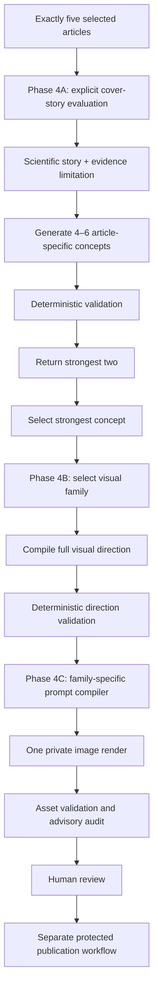

# PHASE 4 LITE — Vitalspan Cover Engine v2.0

Status: Final story-first architecture

Role: Canonical implementation blueprint

Version: 2.0

Supersedes for implementation: `docs/BRIEF_COVER_PHASE_4.md` and Phase 4 Lite v1.x

Governing visual sources:

- `.claude/VITALSPAN_ART_BIBLE.md` v2.0
- `.claude/FOUNDING_COVER_DNA.md` v1.1

---

## 1. Executive decision

Vitalspan covers are story-first.

Every weekly Brief still contains exactly five selected articles. The cover engine explicitly evaluates those five, selects one cover story, extracts its strongest scientific story and evidence limitation, generates several article-specific concepts, selects the strongest concept, and only then chooses a visual family.

The permanent order is:

> **Five selected articles → strongest cover story → central scientific story → evidence limitation → 4–6 concepts → strongest two → selected concept → visual family → visual direction → compiled prompt → one render**

The other four articles may influence the issue title or editor's letter. They do not have to appear in the core cover composition.

Production cover-story selection is deterministic in the operational sense: it is an explicit, source-grounded editorial evaluation with a recorded result and reason. It is never random. Random selection exists only in an isolated, explicitly local-test helper.

---

## 2. Goals

- Select the most editorially and visually powerful story among exactly five chosen articles.
- Confirm or overturn the existing deterministic cover nomination explicitly.
- Preserve article-specific scientific content through concept, direction, and prompt compilation.
- Generate four to six meaningfully different concepts before selecting a family.
- Prefer Living Tapestry when justified without forcing it.
- Make Landscape carry a scientific environmental event.
- Restrict Architecture to named scientific structural relationships.
- Make Living Still exceptional rather than a medium-confidence fallback.
- Produce one memorable macro silhouette and close-view scientific discovery.
- Preserve evidence limitations without turning the image into a generic uncertainty metaphor.
- Keep generation private, review-first, bounded, and separately approved.

## 3. Non-goals

- Synthesize all five articles into one generic cover thesis.
- Force one object per article into the artwork.
- Invent a shared mechanism among unrelated papers.
- Choose a visual family before concept selection.
- Use visual-family quotas.
- Generate several final images by default.
- Automatically approve, publish, deploy, migrate, or modify an existing cover.
- Turn the founding cover into a reusable layout.

---

## 4. Pipeline



The normal creative path uses:

- One structured text call for cover-story evaluation, story extraction, and concept generation.
- One structured text call for visual direction.
- One deterministic prompt compiler.
- One image render.
- One advisory image audit when enabled.
- Human approval before publication.

Retries belong to bounded orchestration, not provider adapters.

---

## 5. Phase 4A input

Phase 4A receives exactly five `CoverStoryArticle` records:

```ts
interface CoverStoryArticle {
  candidateId: string
  title: string
  journal: string
  publicationDate: string
  sourcePhrase: string
  abstract?: string
  studyType?: string
  evidenceLabel?: string
  limitations?: string
  evidenceScore?: number
  relevanceScore?: number
  noveltyScore?: number
}
```

It also receives:

- `deterministicCoverArticleId`, when the draft has an existing cover nomination.
- Global claims the artwork must not imply.

It does not receive:

- Issue-wide visual thesis
- Visual family
- Hero object
- Supporting objects
- Physical world
- Composition
- Palette
- Lighting
- Image-provider syntax

Exactly five distinct article IDs are a hard validation requirement.

---

## 6. Cover-story selection and story extraction

The model evaluates every article using:

- Scientific significance
- Visual potential
- Reader curiosity
- Editorial relevance to longevity
- Credible evidence
- Freshness or surprise
- Capacity for a memorable visual story without overstatement

The output records:

```ts
interface CoverStoryExtraction {
  coverStoryCandidateId: string
  coverStoryReason: string
  centralFinding: string
  whyItMatters: string
  editorialQuestion: string
  principalUncertainty: string
  prohibitedClaims: string[]
  visualStorySentence: string
}
```

`coverStoryReason` must explain why the winner has the strongest overall combination. If the existing deterministic cover article loses, the reason must make the editorial trade-off legible.

`visualStorySentence` is one vivid sentence describing the scientific idea to visualize. It is not a style, object list, or generic evidence qualification.

The selected ID must belong to the five inputs. The central finding and importance must lexically ground to the selected article's title, source phrase, abstract, or limitations.

---

## 7. Concept generation

After the story is selected and extracted, Phase 4A generates four to six strongest-first concepts for that article alone.

```ts
interface CoverVisualConcept {
  visualStory: string
  relationship: string
  visualEvent: string
  scientificAnchor: string
  whyMemorable: string
  editorialScores: {
    novelty: number
    originality: number
    scientificAmbiguity: number
    narrativeClarity: number
  }
  suitableVisualFamilies: Array<
    'Living Tapestry' | 'Landscape' | 'Architecture' | 'Living Still'
  >
  prohibitedImplications: string[]
}
```

A hero object is not required.

### Hard validation

- Four to six concepts before filtering.
- Exact schema and bounded strings.
- Scientific anchor grounded in the selected article.
- At least one suitable visual family.
- At least one prohibited implication.
- No unsupported certainty or cure language.
- No generic evidence metaphor.
- No familiar still-life recipe.
- No object inventory.
- No vague decorative abstraction.
- No exact or conservative near-duplicate.
- Every concept self-scores from 1–5 for novelty, originality, productive scientific ambiguity, and narrative clarity.
- Minimum scores are 4 novelty, 4 originality, 3 scientific ambiguity, and 4 narrative clarity.
- The concept-level one-second test rejects a familiar primary object before ranking. Microscopic internal references do not fail this test.

The Phase 4A editor prefers woven systems, living fabrics, emergent structures, interconnected fields, dynamic gradients, layered ecologies, biological topology, adaptive geometries, network tension, and collective emergence. A concept is discarded if readers would recognize a named object before decoding its scientific relationship. Discarded concepts are not repaired, promoted, or silently reworded; the next action is to generate a different concept.

At least two concepts must survive. Generator order is the editorial ranking, so the first two survivors are returned as `strongestTwo`, and the first survivor is the default `selectedConcept` unless an editor explicitly chooses the other survivor.

The other four articles are not passed forward as visual material.

---

## 8. Phase 4B visual direction

Phase 4B receives:

- The selected cover-story extraction
- One selected concept
- Current Art Bible
- Advisory Founding Cover DNA
- Up to eight recent-cover summaries

The family is selected at this stage, never before.

### Family preference

1. Living Tapestry
2. Landscape
3. Architecture
4. Living Still

This is a preference, not a hard percentage allocation.

### Family tests

#### Living Tapestry

Use when the source supports biological continuity, connected systems, metabolism, neurobiology, cardiovascular biology, muscle physiology, cellular adaptation, or a cross-scale mechanism. Require integrated organic language, macro/micro transition, and scientific detail.

#### Landscape

Require the environmental event to map directly to the selected finding. Beautiful scenery is insufficient.

#### Architecture

Require a named scientific structural relationship: barrier, access, compartment, threshold, scaffold, structural failure, protected/exposed region, permeability, or translation. Reject generic planes, blocks, corridors, voids, and fashionable abstraction.

#### Living Still

Require a one-sentence justification proving why one physical relationship is uniquely appropriate. Reject tasteful arrangements and recurring props unless the source story itself specifically requires them.

### Direction output

```ts
interface VisualDirection {
  selectedVisualFamily: VisualFamily
  familyJustification: string
  dominantScientificRelationship: string
  visualWorld: string
  visualEvent: string
  structuralContinuity: string
  macroComposition: string
  microDetailLanguage: string
  depthStrategy: string
  focalPath: string
  silhouettePlan: string
  materialLanguage: string
  colorStrategy: string
  lightingStrategy: string
  uncertaintyTreatment: string
  prohibitedImplications: string[]
  optionalForms: string[]
}
```

The direction may describe an integrated field with no central object. `optionalForms` is derived last and may be empty.

### Direction validation

- Family appears in the selected concept's suitable families.
- Dominant relationship and visual event ground to the selected article and concept.
- One memorable macro silhouette is explicit.
- Close-view scientific discovery is explicit.
- Structural continuity is explicit.
- Evidence limitation is expressed visually without replacing specificity.
- Canonical restrained color and upper-left cool morning light are present.
- No provider syntax.
- No unsupported claim strength.
- No founding-cover motif copying.
- No object inventory or default still-life family.
- Recent-world repetition produces a warning.

### Phase 4B editorial distinctiveness gate

After Phase 4B direction validation and before Phase 4C prompt compilation, the editor applies one additional acceptance gate to `macroComposition` and `silhouettePlan`:

> If a reader saw this image for one second, would they immediately identify the dominant object?

If yes, the selected concept is rejected and the next action is `reject_concept_and_generate_replacement`. It cannot proceed to prompt compilation or render acceptance.

The gate rejects familiar primary silhouettes including trees, Tree of Life, bonsai, flowers, leaves, brains, neuron icons, DNA helices, hearts, lungs, eyes, hands, butterflies, globes, planets, mountains, rivers, suns, coral, roots, blood vessels, mushrooms, and recognizable animals. The list is not exhaustive. Tree-like canopy/crown constructions and brain-like paired neural lobes are also rejected even when the literal object name is omitted.

Familiar biological forms may remain as subtle internal references in `visualWorld` or `microDetailLanguage`. They fail only when they control the macro composition or one-second silhouette. Preferred dominant reads are unfamiliar woven living systems, adaptive tissue, emergent biological topology, interconnected ecological structures, layered neural fabrics, and dynamic cellular fields.

This is a deterministic editorial filter. It does not alter article scoring, cover-story selection, visual-family selection, prompt architecture, provider parameters, persistence, or production behavior.

---

## 9. Phase 4C prompt compiler

Phase 4C is deterministic. It compiles one concise provider-ready prompt from the cover story, selected concept, and validated direction.

### Invariants

- 170–260 words including exclusions.
- The first words are `Scientific visual story:` followed by the article-specific visual-story sentence.
- Scientific anchor and dominant relationship precede family and form instructions.
- The whole Art Bible is never serialized into the prompt.
- Fixed portrait output: 1152 × 1536, 3:4.
- Upper 18% quiet, central 70% meaningful, lower 12–15% nonessential.
- No generated typography, logo, signature, or watermark.
- No provider-specific syntax inside the creative prompt.
- One render and no external provider retry flag.

### Four compiler branches

#### Living Tapestry

Explicitly preserve:

- One continuous visual language
- Integrated organic systems
- Macro-to-micro transitions
- Scientific linework embedded in material texture
- Symbolic, transformed biology
- Rich but disciplined detail
- Nature, Scientific American, NYT Science, and Guardian Science editorial sensibility
- One memorable silhouette

#### Landscape

State that the environmental event maps directly to the finding and that the landscape must carry the scientific relationship rather than provide scenery.

#### Architecture

Name the scientific structural relationship and reject generic planes, blocks, corridors, monumental voids, and fashionable abstraction.

#### Living Still

Include the one-sentence proof that the physical relationship is uniquely appropriate. Reject bowls, vessels, tabletop arrangements, and generic props unless scientifically required by the source story.

---

## 10. Provider boundary

The compiled provider request is fixed:

```json
{
  "model": "gpt-image-2",
  "n": 1,
  "size": "1152x1536",
  "quality": "medium",
  "output_format": "png"
}
```

The image provider realizes the direction. It does not choose the cover story, invent the concept, or merge the other four articles into the composition.

### Phase 4D final render gate

Immediately before a provider request plan is accepted, the immutable concept, direction, and compiled prompt receive one final editorial review. The package is rejected when the primary silhouette is recognizable, the metaphor is familiar, or its declared treatment resembles stock illustration, AI concept art, educational textbook art, wellness branding, or Tree of Life imagery.

This gate never edits the direction, refines the prompt, or retries the same concept. A rejection returns `discard_and_generate_different_concept`; only a clean package returns `accept_for_single_render`. The local `render-review` command exposes the complete decision without invoking an image provider.

Phase 4A, the Phase 4B-to-4C boundary, and Phase 4D all use the phase-discriminated reviewer in `briefCoverEditorialDistinctiveness.ts`. Its shared object rules and dominant-silhouette evaluator are the single canonical implementation; phase adapters do not duplicate rejection criteria.

Generated assets remain private until separate human approval. Provider credentials, response bodies, and image bytes are not stored in editorial metadata.

---

## 11. Admin commands

Read-only creative commands:

```sh
npm run brief:admin -- generate-cover-concepts <draft-id>
npm run brief:admin -- generate-cover-direction <draft-id> --concept <conceptId> --candidate-file <phase4a-result.json>
npm run brief:admin -- compile-cover-prompt <draft-id> --concept <conceptId> --direction-file <phase4b-result.json>
```

The first command reads exactly five selected article records and the deterministic cover nomination. The commands report `persisted: false`; direction and compiler commands invoke no image provider.

Local fixture-only preview:

```sh
npm run brief:cover -- preview
npm run brief:cover -- concepts
npm run brief:cover -- direction
npm run brief:cover -- prompt
```

The local CLI contains no Supabase client and no generate, publish, deploy, migrate, approve, or reject command.

---

## 12. Issue 1 read-only preview contract

The local preview reports:

1. All five selected articles
2. Selected cover story
3. Why it won
4. Central finding
5. Editorial question
6. Principal uncertainty
7. Visual-story sentence
8. Four to six concepts
9. Strongest two concepts
10. Selected concept
11. Selected visual family and justification
12. Full visual direction
13. Exact compiled prompt

It also reports explicit safety flags:

- `localOnly: true`
- `productionSupabaseCalled: false`
- `providerInvoked: false`
- `imageGenerated: false`

No preview operation modifies existing production covers or editorial state.

---

## 13. Review and publication safety

Deterministic validation can establish schema, grounding, length, family compatibility, provider neutrality, crop guidance, and prohibited language. It cannot establish beauty or editorial authority.

Human review remains responsible for:

- Memorability
- Second-look curiosity
- Emotional consequence
- Scientific interpretation
- Whether the visual event is intelligible without reading the prompt
- Whether the result feels recognizably Vitalspan
- Approval, rejection, and publication

Generation never implies approval. Approval never implies publication. Publication remains a separate protected action.

---

## 14. Acceptance criteria

Implementation is complete when:

- Exactly five selected articles are required.
- The deterministic cover nomination is explicitly evaluated.
- The cover-story extraction contains all eight required fields.
- Four to six article-specific concepts are generated.
- Every concept carries the four required editorial self-scores and clears the score floor before ranking.
- The strongest two and one selected concept are explicit.
- All four visual families are supported after concept selection.
- Living Tapestry is preferred when grounded.
- Architecture and Living Still have their special proof requirements.
- The compiler has four concise branches and starts with the scientific story.
- The one-second editorial distinctiveness gate blocks familiar dominant-object silhouettes before Phase 4C.
- The final Phase 4D review rejects familiar metaphors and generic stock, AI-concept-art, textbook, or wellness treatments without refinement.
- Prompts remain between 170 and 260 words.
- The local Issue 1 preview reports all thirteen required outputs.
- TypeScript, Jest, Deno checks, and `git diff --check` pass.
- No image is generated and no production state is contacted or modified during the preview.
