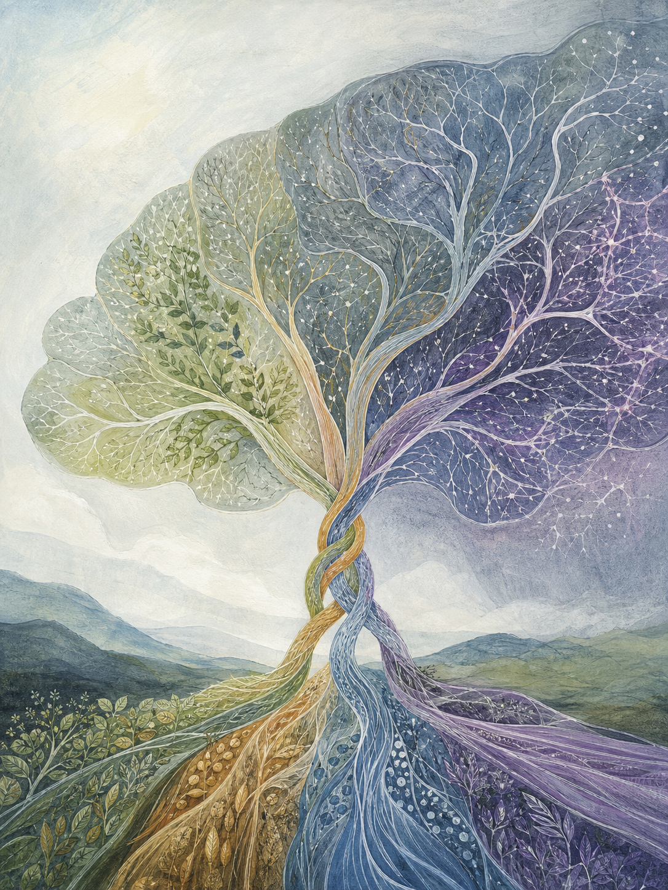
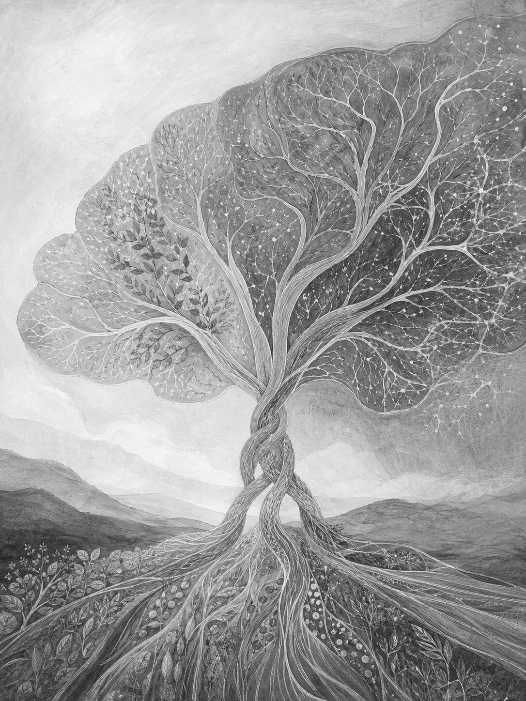
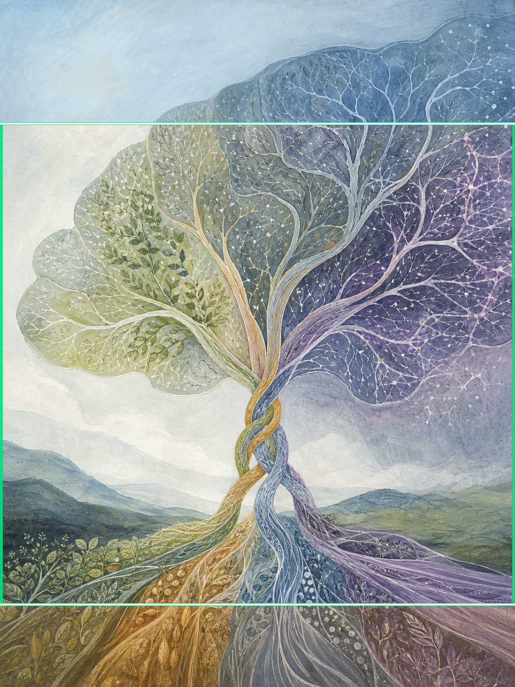

# Phase 4D — First Story-First Production Render Review

Status: Validation only

Issue: 1

Render attempts: **1**

Image-generation calls: **1**

Retries or regenerations: **0**

Prompt changes: **0**

Production Supabase contacts: **0**

The image was generated once with the existing 256-word Phase 4C prompt. The workspace full-size PNG is a display-normalized encoding of that same render; no generative edit was applied. The thumbnail, grayscale image, and crop overlay are deterministic local derivatives.

## 1. Full-size image

Dimensions: 1086 × 1448 px, exact 3:4 aspect ratio.

The image has a clear central braid of four differently colored and textured currents that becomes a vascular, leaf-like neural canopy. It is materially restrained and immediately legible. Its main weakness is conceptual over-resolution: the four inputs merge into one healthy, flourishing tree-like organism, making the result feel more conclusive and mechanistically unified than the paper supports.

## 2. Thumbnail at approximately 80 px

Dimensions: 80 × 107 px.

Thumbnail result: **Pass for silhouette, partial pass for story.** The braided trunk and broad canopy remain recognizable, and the four lower color bands are still visible. Fine scientific texture disappears cleanly. However, at this scale the image reads first as a familiar “tree of life” symbol; the cognitive and multidomain-trial specificity largely disappears.

## 3. Grayscale version

Grayscale result: **Pass for hierarchy, partial pass for domain separation.** The main braid, canopy, and vascular detail retain strong tonal separation. The four domains become less distinguishable because color performs more of that work than texture. The image remains compositionally coherent, but the convergence looks even more complete in grayscale.

## 4. Crop-safety overlay

Overlay legend:

- Blue tint: upper 18% quiet zone
- Green rectangle: central 70% meaning-safe zone
- Amber tint: lower 12% nonessential zone

Crop result: **Fail overall.** The braid and main convergence sit safely inside the central 70%, and enough of the four lower currents remains above the bottom boundary for the metaphor to survive. But substantial canopy mass, branching detail, and high-contrast scientific linework occupy the upper 18%; this is not a quiet masthead zone. The lower band also contains meaningful domain textures, although those details are duplicated above the boundary and are not strictly indispensable.

## 5. Founding Cover DNA comparison

| Benchmark | Result | Comparison |
|---|---|---|
| Continuity | Strong | The four currents, trunk, folds, and canopy share one visual grammar. |
| Macro/micro depth | Strong | A clear silhouette survives reduction, while vascular, cellular, fibrous, and botanical marks reward close viewing. |
| Scientific texture | Moderate | Linework is abundant and disciplined, but often reads as surface ornament rather than evidence-bearing biological structure. |
| Second-look curiosity | Weak–moderate | The hybrid landscape/neural canopy invites a second glance, but the tree metaphor resolves almost immediately and leaves limited ambiguity. |
| Selective emphasis | Moderate | The central braid is clear, yet canopy detail is distributed too evenly and competes with the required quiet zone. |
| Memorable silhouette | Strong | The narrow braid and broad asymmetric crown are recognizable at 80 px. |
| Material specificity | Moderate–strong | Paper tooth, glazing, fine linework, and restrained pigment feel hand-made, though cleaner and more decorative than the founding cover's accumulated patina. |
| Evidence-sensitive ambiguity | Weak | The complete, flourishing canopy implies successful integration and possibly a shared pathway; uncertainty and durability are not visually forceful enough. |
| Founding-cover independence | Pass | It does not copy the gut–heart–brain inventory, dark ground, palette, or exact founding composition. |

Against the founding benchmark, this render succeeds in continuity, silhouette, and macro/micro layering but falls short in multivalent interpretation, material gravity, and evidence-sensitive ambiguity. The founding cover feels like an unresolved scientific world; this render feels closer to a polished illustration of a known answer.

## 6. Why does this image represent THIS week's selected scientific story?

This image represents this week's LatAm-FINGERS story because four visibly distinct currents stand for the coordinated lifestyle domains, their braid makes the package-level intervention legible, and their expansion into a vascular neural canopy connects that coordination to the reported cognitive outcome; the strands remain individually colored and textured, which gestures toward unresolved component attribution, while the pale outer canopy attempts to suggest uncertain durability, although the final visual is more harmonious and complete than the evidence limitation warrants.

## 7. Explicit editorial answers

| Question | Answer | Judgment |
|---|---|---|
| Does the image communicate the chosen paper? | **Partially.** | It communicates a multidomain intervention converging on cognition, but not the Latin American older-adult trial with enough specificity to distinguish it from a generic integrated-lifestyle story. |
| Does it communicate the winning metaphor? | **Yes.** | Four distinct streams visibly braid into a neural canopy; this is the clearest success of the render. |
| Does it avoid object-first storytelling? | **Qualified no.** | The relationship drives the construction, not a prop inventory, but the image ultimately collapses into a familiar central tree-of-life hero object. |
| Does it feel like Nature / Scientific American / NYT Science / Guardian Science editorial illustration? | **Partially.** | It has appropriate restraint, craft, and scientific texture, but the literal convergence, pastel harmony, and familiar tree symbol make it feel closer to polished AI concept art than a world-class editorial argument. |
| Would you approve it for publication? | **No.** | The upper crop-safe zone fails, the image overstates unity and resolution, the paper-specific signal is too generic, and the central tree metaphor is not original enough for the editorial standard. |

## Final validation verdict

**The story-first architecture successfully transmitted the selected metaphor, visual family, macro silhouette, and scientific-texture requirements into a coherent render. It did not reliably transmit the evidence limitation, paper-specific distinctiveness, crop restraint, or the required level of editorial originality. Publication approval is not recommended.**
